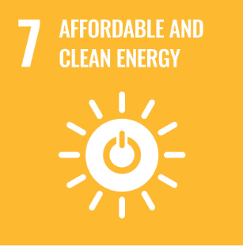

# GloHydroRes-VizLab

**Visualizing Global Hydropower Infrastructure with Clarity, Accessibility, and Insight.**

---

## Table of Contents
- [Project Overview](#project-overview)  
- [Authors and Contributions](#authors-and-contributions)  
- [Statement of Contribution to SDGs](#statement-of-contribution-to-sdgs)  
- [Statement of Intellectual and Professional Growth](#statement-of-intellectual-and-professional-growth)
- [Accessibility Considerations](#accessibility-considerations)  
- [Dataset](#dataset)  
  - [Source Datasets](#source-datasets) 
- [Repository Structure and Navigation](#repository-structure-and-navigation)  
- [Installation and Usage](#installation-and-usage)  
- [Visual Modules](#visual-modules)  
- [Citation](#citation)  
- [Acknowledgements](#acknowledgements)  
- [Competing Interests](#competing-interests)  
- [Disclaimer](#disclaimer)  

---

## Project Overview

**GloHydroRes-VizLab** is an interactive dashboard built with Streamlit to visualize the [GloHydroRes](https://zenodo.org/records/14526360) dataset—an open-access compilation of global hydropower plants and reservoirs. This project enhances interpretability through:

- Color-blind-friendly visual design  
- Dynamic geospatial and temporal graphs  
- Transparent representation of hydropower development trends  

🔗 **[Live Dashboard](https://info301-dash-dashboard.onrender.com/)**  

🎥 **Demo Video:**  [Watch the demo (MP4)](Demo%20Video.mp4)

🖼️ **Poster Preview:**  [View Poster](Poster.pdf)

---

## Authors and Contributions

- **Yuxi Wang**: Data integration, GitHub management, visualization dashboard development.
- **Mohamed Sami Koudir**: Machine learning analysis, anomaly detection, visual design optimization.
- **Yuxing Zhang**: Literature review, cross-disciplinary integration, stakeholder communication strategies.​

---

## Statement of Contribution to SDGs



This project contributes to **UN Sustainable Development Goal 7: Affordable and Clean Energy** by:

- Promoting transparency in hydropower infrastructure  
- Enabling evidence-based energy policy and planning  
- Supporting equitable access to data on renewable energy
  
---

## Statement of Intellectual and Professional Growth

This project deepened my ability to synthesize large, geospatial datasets and transform them into interactive tools for analysis. I gained hands-on experience with:

- Visual storytelling via Streamlit and Plotly  
- Clean code architecture and modular design  
- Communicating complex trends to diverse audiences  

It also improved my skills in collaborative version control, open-source licensing, and sustainable development framing.

---

## Accessibility Considerations

- Color schemes safe for color vision deficiencies (e.g., Viridis)
- Clear legends and axis labels
- Scalable vector outputs for readability

---
## Dataset

The project uses the *GloHydroRes* dataset (Shah et al., 2025), which integrates spatial and technical information on hydropower facilities globally. For citation, please refer to:

> Shah, J., Hu, J., Edelenbosch, O., & van Vliet, M. (2025). *Global dataset combining open-source hydropower plant and reservoir data*. Scientific Data, 12. https://doi.org/10.1038/s41597-025-04975-0

### Source Datasets

The GloHydroRes dataset is a harmonized and cleaned compilation built from the following primary data sources:

- **Global Power Plant Database** by World Resources Institute (WRI):  
  https://datasets.wri.org/dataset/globalpowerplantdatabase  
- **HILARRI (Hydropower Infrastructure – Lakes, Reservoirs, and Rivers), v2**:  
  https://hydrosource.ornl.gov/dataset/hilarri-v2  
- **Existing Hydropower Assets (EHA) Plant Database, 2022**:  
  https://hydrosource.ornl.gov/dataset/EHA2022  
- **JRC Hydro-power Plants Database**:  
  https://github.com/energy-modelling-toolkit/hydro-power-database/  
- **RePP Africa** – Renewable Power Plant Database for Africa:  
  https://www.nature.com/articles/s41597-022-01922-1  
- **Global Reservoir and Dam (GRanD) Database**:  
  https://depts.washington.edu/saswe/grand/GRanD_Technical_Documentation_v1_1.pdf  
- **GeoDAR (Georeferenced Global Dams and Reservoirs)**:  
  https://essd.copernicus.org/articles/14/1869/2022/  
- **Global Dam Tracker (GDAT)**:  
  https://www.nature.com/articles/s41597-023-02008-2  
- **HydroLAKES**:  
  https://www.hydrosheds.org/products/hydrolakes  
- **HydroSHEDs 15 arc-second DEM** (used to determine dam elevation):  
  https://www.hydrosheds.org/hydrosheds-core-downloads

These data sources were pre-processed and merged to create the unified GloHydroRes dataset used in this project.

---

## Repository Structure and Navigation

```
GloHydroRes-VizLab/
├── data/ # Raw and merged datasets
│ ├── GloHydroRes_vs1.csv
│ ├── GlobalLandTemperaturesByCountry.csv
│ └── IBT_GloHydroRes_Hydropower_Combined.csv
│
├── scripts/ # Python visualization modules
│ ├── main.py # Dashboard entry point
│ ├── preprocessing.py # Data cleaning pipeline
│ ├── plot_choropleth.py # Choropleth map
│ ├── plot_bubble.py # Bubble map
│ ├── plot_sunburst.py # Sunburst chart
│ ├── plot_timeseries.py # Time series plots
│ ├── plot_animated.py # Animated facility evolution
│ └── plot_treemap.py # Treemap of facility/country shares
│
├── Demo Video.mp4 # Final demo presentation
├── Poster.pdf # Final poster for presentation
├── E_SDG_PRINT-07.jpg # SDG logo used in README
├── SDG.png # Alternative SDG visualization icon
├── requirements.txt # Environment setup
└── README.md # Project overview and navigation
```
### Navigation Tips

- Run the dashboard via `main.py` in `scripts/`  
- View processed datasets in `/data/`  
- Demo & poster available in root directory  

---

## Installation and Usage

### 1. Clone the Repository

```bash
git clone https://github.com/wailywang/GloHydroRes-VizLab.git
cd GloHydroRes-VizLab
```

### 2. Set Up the Environment

```bash
python -m venv venv
source venv/bin/activate  # On Windows: venv\Scripts\activate
pip install -r requirements.txt
```

### 3. Download the Dataset

Place `GloHydroRes_vs1.csv` in the `data/` directory.  
Dataset DOI: [10.5281/zenodo.14526360](https://doi.org/10.5281/zenodo.14526360)

### 4. Run Visualizations

```bash
python scripts/main.py
```

Each plot will be rendered interactively in your browser or window.

---

## Visual Modules

This dashboard visualizes global hydropower infrastructure using multiple interactive visualizations powered by **Streamlit** and **Plotly**:

- **Choropleth Map**: Displays total installed hydropower capacity by country using ISO3 codes and color intensity  
- **Bubble Map**: Visualizes individual plant locations with bubble size proportional to reservoir volume  
- **Sunburst Chart**: Shows capacity distribution in a hierarchical structure: Country → Facility  
- **Time Series Plot**: Tracks installed hydropower capacity over time by country (multi-selectable)  
- **Animated Evolution Map**: Reveals spatiotemporal growth of facilities year by year  
- **Treemap**: Highlights facility and country contributions in proportional tree structure  

> **Interactive Dashboard (Built with Streamlit)**  
> [Explore the Live App »](https://info301-dash-dashboard.onrender.com/)

---

## Citation

To cite this project or dataset in academic work:

```bibtex
@article{shah2025glohydrores,
  author = {Shah, Jignesh and Hu, Jing and Edelenbosch, Oreane and van Vliet, Michelle},
  year = {2025},
  month = {04},
  title = {Global dataset combining open-source hydropower plant and reservoir data},
  journal = {Scientific Data},
  volume = {12},
  doi = {10.1038/s41597-025-04975-0}
}
```

---

## Acknowledgements

This project was completed as part of the course INFOSCI 301 – Data Visualization and Information Aesthetics at Duke Kunshan University. We would like to sincerely thank Prof. Luyao Zhang for her guidance throughout the semester, and Prof. Ming-Chun Huang for his valuable feedback during the DKU Digital Technology for Sustainability Symposium. Special thanks also go to Dr. Dongping Liu and Dr. David Schaaf for their helpful insights and encouragement during the development of this project. Lastly, we thank my classmates in INFOSCI 301 for their thoughtful input and collaboration during the semester. 

This project was made possible with the support of AIGC tools such as ChatGPT and open-source software libraries including Plotly, Pandas, and Dash, which enabled the development of our interactive dashboard.

---

## Competing Interests

The authors declare no competing interests.  
Refer to [Scientific Data policies](https://www.nature.com/sdata/policies) for definitions.


---

## Disclaimer

This repository is part of a final course project submitted for academic credit in INFOSCI 301 – Data Visualization and Information Aesthetics at Duke Kunshan University, Spring 2025.

---
