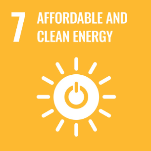

# GloHydroRes-VizLab

**Visualizing Global Hydropower Infrastructure with Clarity, Accessibility, and Insight.**

---

## Overview

**GloHydroRes-VizLab** is a data-driven visualization project that enhances the interpretability of the [GloHydroRes](https://zenodo.org/records/14526360) dataset—an open-source compilation of global hydropower plant and reservoir data. The objective is to support research, policy design, and public understanding through:

- **Accessible** design, including color-blind friendly palettes  
- **Interpretable** and interactive graphical representations  
- **Insightful** presentations that reveal geographic and temporal trends

---

## Dataset

The project uses the *GloHydroRes* dataset (Shah et al., 2025), which integrates spatial and technical information on hydropower facilities globally. For citation, please refer to:

> Shah, J., Hu, J., Edelenbosch, O., & van Vliet, M. (2025). *Global dataset combining open-source hydropower plant and reservoir data*. Scientific Data, 12. https://doi.org/10.1038/s41597-025-04975-0

---

## Project Directory

```
GloHydroRes-VizLab/
├── data/
│   └── GloHydroRes_vs1.csv                # Source dataset (to be placed manually)
├── scripts/
│   ├── load_data.py                       # Data loading and preprocessing
│   ├── plot_top_countries.py              # Top hydropower countries visualization
│   ├── plot_year_distribution.py          # Commissioning years distribution
│   ├── plot_facility_map.py               # Interactive plant map
│   └── main.py                            # Master script for visualization generation
├── requirements.txt                       # Python dependencies
└── README.md                              # Project documentation
```

---

## Installation and Usage

### 1. Clone the Repository

```bash
git clone https://github.com/wailywang/GloHydroRes-VizLab.git
cd GloHydroRes-VizLab
```

### 2. Set Up the Environment

```bash
python -m venv venv
source venv/bin/activate  # On Windows: venv\Scripts\activate
pip install -r requirements.txt
```

### 3. Download the Dataset

Place `GloHydroRes_vs1.csv` in the `data/` directory.  
Dataset DOI: [10.5281/zenodo.14526360](https://doi.org/10.5281/zenodo.14526360)

### 4. Run Visualizations

```bash
python scripts/main.py
```

Each plot will be rendered interactively in your browser or window.

---

## Visual Modules

This dashboard visualizes global hydropower infrastructure using multiple interactive visualizations powered by **Streamlit** and **Plotly**:

- **Choropleth Map**: Displays total installed hydropower capacity by country using ISO3 codes and color intensity  
- **Bubble Map**: Visualizes individual plant locations with bubble size proportional to reservoir volume  
- **Sunburst Chart**: Shows capacity distribution in a hierarchical structure: Country → Facility  
- **Time Series Plot**: Tracks installed hydropower capacity over time by country (multi-selectable)  
- **Animated Evolution Map**: Reveals spatiotemporal growth of facilities year by year  
- **Treemap**: Highlights facility and country contributions in proportional tree structure  

> **Interactive Dashboard (Built with Streamlit)**  
> [Explore the Live App »](https://info301-dash-dashboard.onrender.com/)

---

## Accessibility Considerations

- Color schemes safe for color vision deficiencies (e.g., Viridis)
- Clear legends and axis labels
- Scalable vector outputs for readability

## Sustainable Development Goals



### SDG 7: Affordable and Clean Energy

Hydropower is a key renewable energy source that contributes significantly to global clean energy supply. This project supports SDG 7 by:

- Promoting transparency in hydropower infrastructure data  
- Enabling better planning and optimization through data visualization  
- Highlighting both opportunities and trade-offs in sustainable energy development

By integrating hydropower data into an accessible dashboard, our project encourages evidence-based approaches to clean and affordable energy for all.

---

## Contribution Guidelines

We welcome enhancements in visual style, geographic analysis, or code optimization.

1. Fork the repo and create a new branch  
2. Implement your changes  
3. Submit a pull request or open an issue for discussion

---

## Citation

To cite this project or dataset in academic work:

```bibtex
@article{shah2025glohydrores,
  author = {Shah, Jignesh and Hu, Jing and Edelenbosch, Oreane and van Vliet, Michelle},
  year = {2025},
  month = {04},
  title = {Global dataset combining open-source hydropower plant and reservoir data},
  journal = {Scientific Data},
  volume = {12},
  doi = {10.1038/s41597-025-04975-0}
}
```

---

## Acknowledgements

This project was completed as part of the course INFOSCI 301 – Data Visualization and Information Aesthetics at Duke Kunshan University. We would like to sincerely thank Prof. Luyao Zhang for her guidance throughout the semester, and Prof. Ming-Chun Huang for his valuable feedback during the DKU Digital Technology for Sustainability Symposium. Special thanks also go to Dr. Dongping Liu and Dr. David Schaaf for their helpful insights and encouragement during the development of this project. Lastly, we thank my classmates in INFOSCI 301 for their thoughtful input and collaboration during the semester. 

This project was made possible with the support of AIGC tools such as ChatGPT and open-source software libraries including Plotly, Pandas, and Dash, which enabled the development of our interactive dashboard.

---

## Competing Interests

The authors declare no competing interests.  
Refer to [Scientific Data policies](https://www.nature.com/sdata/policies) for definitions.


---

## Source Datasets

The GloHydroRes dataset is a harmonized and cleaned compilation built from the following primary data sources:

- **Global Power Plant Database** by World Resources Institute (WRI):  
  https://datasets.wri.org/dataset/globalpowerplantdatabase  
- **HILARRI (Hydropower Infrastructure – Lakes, Reservoirs, and Rivers), v2**:  
  https://hydrosource.ornl.gov/dataset/hilarri-v2  
- **Existing Hydropower Assets (EHA) Plant Database, 2022**:  
  https://hydrosource.ornl.gov/dataset/EHA2022  
- **JRC Hydro-power Plants Database**:  
  https://github.com/energy-modelling-toolkit/hydro-power-database/  
- **RePP Africa** – Renewable Power Plant Database for Africa:  
  https://www.nature.com/articles/s41597-022-01922-1  
- **Global Reservoir and Dam (GRanD) Database**:  
  https://depts.washington.edu/saswe/grand/GRanD_Technical_Documentation_v1_1.pdf  
- **GeoDAR (Georeferenced Global Dams and Reservoirs)**:  
  https://essd.copernicus.org/articles/14/1869/2022/  
- **Global Dam Tracker (GDAT)**:  
  https://www.nature.com/articles/s41597-023-02008-2  
- **HydroLAKES**:  
  https://www.hydrosheds.org/products/hydrolakes  
- **HydroSHEDs 15 arc-second DEM** (used to determine dam elevation):  
  https://www.hydrosheds.org/hydrosheds-core-downloads

These data sources were pre-processed and merged to create the unified GloHydroRes dataset used in this project.
